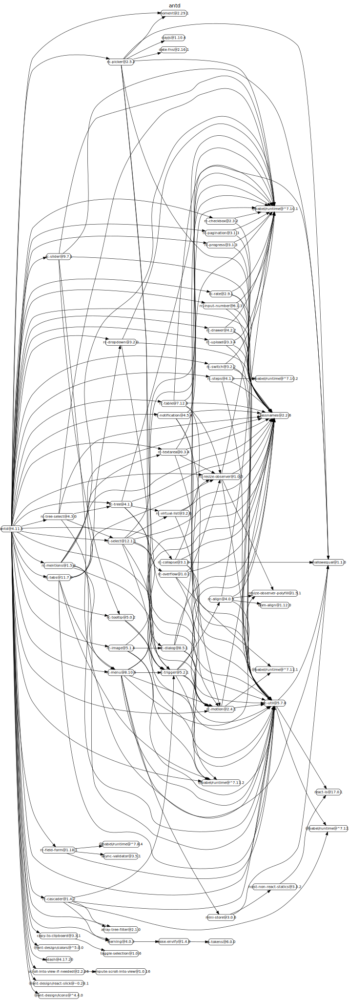
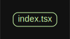

# 源码分析

## 文件结构

``` bash
/Users/liufang/openSource/FunnyLiu/ant-design
├── AUTHORS.txt
├── CHANGELOG.en-US.md
├── CHANGELOG.zh-CN.md
├── CNAME
├── CODEOWNERS
├── CODE_OF_CONDUCT.md
├── Dockerfile.ui-test
├── LICENSE
├── README-pt_BR.md
├── README-zh_CN.md
├── README.md
├── SECURITY.md
├── azure-pipelines.yml
├── components
|  ├── __tests__
|  |  ├── __snapshots__
|  |  |  └── index.test.js.snap
|  |  └── index.test.js
|  ├── _util
|  |  ├── __tests__
|  |  |  ├── easings.test.js
|  |  |  ├── getScroll.test.js
|  |  |  ├── getScrollNode.test.ts
|  |  |  ├── responsiveObserve.test.js
|  |  |  ├── scrollTo.test.js
|  |  |  ├── transButton.test.js
|  |  |  ├── unreachableException.test.js
|  |  |  ├── useSyncState.test.js
|  |  |  ├── util.test.js
|  |  |  └── wave.test.js
|  |  ├── colors.ts
|  |  ├── devWarning.ts
|  |  ├── easings.ts
|  |  ├── getDataOrAriaProps.ts
|  |  ├── getRenderPropValue.ts
|  |  ├── getScroll.tsx
|  |  ├── hooks
|  |  |  ├── useForceUpdate.ts
|  |  |  ├── usePatchElement.tsx
|  |  |  └── useSyncState.ts
|  |  ├── isNumeric.ts
|  |  ├── motion.tsx
|  |  ├── raf.ts
|  |  ├── reactNode.ts
|  |  ├── responsiveObserve.ts
|  |  ├── scrollTo.ts
|  |  ├── styleChecker.tsx
|  |  ├── throttleByAnimationFrame.tsx
|  |  ├── transButton.tsx
|  |  ├── type.ts
|  |  ├── unreachableException.ts
|  |  └── wave.tsx
|  ├── affix
|  |  ├── __tests__
|  |  |  ├── Affix.test.tsx
|  |  |  ├── __snapshots__
|  |  |  |  ├── Affix.test.tsx.snap
|  |  |  |  └── demo.test.ts.snap
|  |  |  ├── demo.test.ts
|  |  |  └── image.test.ts
|  |  ├── demo
|  |  |  ├── basic.md
|  |  |  ├── debug.md
|  |  |  ├── on-change.md
|  |  |  └── target.md
|  |  ├── index.en-US.md
|  |  ├── index.tsx
|  |  ├── index.zh-CN.md
|  |  ├── style
|  |  |  ├── index.less
|  |  |  └── index.tsx
|  |  └── utils.ts
|  ├── alert
|  |  ├── ErrorBoundary.tsx
|  |  ├── __tests__
|  |  |  ├── __snapshots__
|  |  |  |  ├── demo.test.ts.snap
|  |  |  |  └── index.test.tsx.snap
|  |  |  ├── demo.test.ts
|  |  |  ├── image.test.ts
|  |  |  └── index.test.tsx
|  |  ├── demo
|  |  |  ├── action.md
|  |  |  ├── banner.md
|  |  |  ├── basic.md
|  |  |  ├── closable.md
|  |  |  ├── close-text.md
|  |  |  ├── custom-icon.md
|  |  |  ├── description.md
|  |  |  ├── error-boundary.md
|  |  |  ├── icon.md
|  |  |  ├── loop-banner.md
|  |  |  ├── smooth-closed.md
|  |  |  └── style.md
|  |  ├── index.en-US.md
|  |  ├── index.tsx
|  |  ├── index.zh-CN.md
|  |  └── style
|  |     ├── index.less
|  |     ├── index.tsx
|  |     └── rtl.less
|  ├── anchor
|  |  ├── Anchor.tsx
|  |  ├── AnchorLink.tsx
|  |  ├── __tests__
|  |  |  ├── Anchor.test.tsx
|  |  |  ├── __snapshots__
|  |  |  |  └── demo.test.ts.snap
|  |  |  ├── demo.test.ts
|  |  |  └── image.test.ts
|  |  ├── context.ts
|  |  ├── demo
|  |  |  ├── basic.md
|  |  |  ├── customizeHighlight.md
|  |  |  ├── onChange.md
|  |  |  ├── onClick.md
|  |  |  ├── static.md
|  |  |  └── targetOffset.md
|  |  ├── index.en-US.md
|  |  ├── index.tsx
|  |  ├── index.zh-CN.md
|  |  └── style
|  |     ├── index.less
|  |     ├── index.tsx
|  |     └── rtl.less
|  ├── auto-complete
|  |  ├── __tests__
|  |  |  ├── __snapshots__
|  |  |  |  ├── demo.test.js.snap
|  |  |  |  └── index.test.js.snap
|  |  |  ├── demo.test.js
|  |  |  ├── focus.test.js
|  |  |  ├── image.test.ts
|  |  |  └── index.test.js
|  |  ├── demo
|  |  |  ├── basic.md
|  |  |  ├── certain-category.md
|  |  |  ├── custom.md
|  |  |  ├── form-debug.md
|  |  |  ├── non-case-sensitive.md
|  |  |  ├── options.md
|  |  |  └── uncertain-category.md
|  |  ├── index.en-US.md
|  |  ├── index.tsx
|  |  ├── index.zh-CN.md
|  |  └── style
|  |     ├── index.less
|  |     └── index.tsx
|  ├── avatar
|  |  ├── SizeContext.tsx
|  |  ├── __tests__
|  |  |  ├── Avatar.test.js
|  |  |  ├── __snapshots__
|  |  |  |  ├── Avatar.test.js.snap
|  |  |  |  └── demo.test.js.snap
|  |  |  ├── demo.test.js
|  |  |  └── image.test.ts
|  |  ├── avatar.tsx
|  |  ├── demo
|  |  |  ├── badge.md
|  |  |  ├── basic.md
|  |  |  ├── dynamic.md
|  |  |  ├── fallback.md
|  |  |  ├── group.md
|  |  |  ├── responsive.md
|  |  |  ├── toggle-debug.md
|  |  |  └── type.md
|  |  ├── group.tsx
|  |  ├── index.en-US.md
|  |  ├── index.tsx
|  |  ├── index.zh-CN.md
|  |  └── style
|  |     ├── group.less
|  |     ├── index.less
|  |     ├── index.tsx
|  |     └── rtl.less
|  ├── back-top
|  |  ├── __tests__
|  |  |  ├── __snapshots__
|  |  |  |  ├── demo.test.js.snap
|  |  |  |  └── index.test.js.snap
|  |  |  ├── demo.test.js
|  |  |  ├── image.test.ts
|  |  |  └── index.test.js
|  |  ├── demo
|  |  |  ├── basic.md
|  |  |  └── custom.md
|  |  ├── index.en-US.md
|  |  ├── index.tsx
|  |  ├── index.zh-CN.md
|  |  └── style
|  |     ├── index.less
|  |     ├── index.tsx
|  |     └── responsive.less
|  ├── badge
|  |  ├── Ribbon.tsx
|  |  ├── ScrollNumber.tsx
|  |  ├── __tests__
|  |  |  ├── __snapshots__
|  |  |  |  ├── demo.test.js.snap
|  |  |  |  └── index.test.js.snap
|  |  |  ├── demo.test.js
|  |  |  ├── image.test.ts
|  |  |  └── index.test.js
|  |  ├── demo
|  |  |  ├── basic.md
|  |  |  ├── change.md
|  |  |  ├── colorful.md
|  |  |  ├── dot.md
|  |  |  ├── link.md
|  |  |  ├── no-wrapper.md
|  |  |  ├── offset.md
|  |  |  ├── overflow.md
|  |  |  ├── ribbbon.md
|  |  |  ├── ribbon-debug.md
|  |  |  ├── size.md
|  |  |  ├── status.md
|  |  |  └── title.md
|  |  ├── index.en-US.md
|  |  ├── index.tsx
|  |  ├── index.zh-CN.md
|  |  ├── style
|  |  |  ├── index.less
|  |  |  ├── index.tsx
|  |  |  ├── ribbon.less
|  |  |  └── rtl.less
|  |  └── utils.tsx
|  ├── breadcrumb
|  |  ├── Breadcrumb.tsx
|  |  ├── BreadcrumbItem.tsx
|  |  ├── BreadcrumbSeparator.tsx
|  |  ├── __tests__
|  |  |  ├── Breadcrumb.test.js
|  |  |  ├── __snapshots__
|  |  |  |  ├── Breadcrumb.test.js.snap
|  |  |  |  ├── demo.test.js.snap
|  |  |  |  └── router.test.js.snap
|  |  |  ├── demo.test.js
|  |  |  ├── image.test.ts
|  |  |  └── router.test.js
|  |  ├── demo
|  |  |  ├── basic.md
|  |  |  ├── overlay.md
|  |  |  ├── router-4.md
|  |  |  ├── separator-indepent.md
|  |  |  ├── separator.md
|  |  |  └── withIcon.md
|  |  ├── index.en-US.md
|  |  ├── index.tsx
|  |  ├── index.zh-CN.md
|  |  └── style
|  |     ├── index.less
|  |     ├── index.tsx
|  |     └── rtl.less
|  ├── button
|  |  ├── LoadingIcon.tsx
|  |  ├── __tests__
|  |  |  ├── __snapshots__
|  |  |  |  ├── demo.test.ts.snap
|  |  |  |  └── index.test.tsx.snap
|  |  |  ├── demo.test.ts
|  |  |  ├── image.test.ts
|  |  |  ├── index.test.tsx
|  |  |  └── wave.test.tsx
|  |  ├── button-group.tsx
|  |  ├── button.tsx
|  |  ├── demo
|  |  |  ├── basic.md
|  |  |  ├── block.md
|  |  |  ├── danger.md
|  |  |  ├── disabled.md
|  |  |  ├── ghost.md
|  |  |  ├── icon.md
|  |  |  ├── legacy-group.md
|  |  |  ├── loading.md
|  |  |  ├── multiple.md
|  |  |  └── size.md
|  |  ├── index.en-US.md
|  |  ├── index.tsx
|  |  ├── index.zh-CN.md
|  |  └── style
|  |     ├── index.less
|  |     ├── index.tsx
|  |     ├── mixin.less
|  |     └── rtl.less
|  ├── calendar
|  |  ├── Header.tsx
|  |  ├── __tests__
|  |  |  ├── __snapshots__
|  |  |  |  ├── demo.test.js.snap
|  |  |  |  └── index.test.js.snap
|  |  |  ├── demo.test.js
|  |  |  ├── image.test.ts
|  |  |  └── index.test.js
|  |  ├── demo
|  |  |  ├── basic.md
|  |  |  ├── card.md
|  |  |  ├── customize-header.md
|  |  |  ├── notice-calendar.md
|  |  |  └── select.md
|  |  ├── generateCalendar.tsx
|  |  ├── index.en-US.md
|  |  ├── index.tsx
|  |  ├── index.zh-CN.md
|  |  ├── locale
|  |  |  ├── ar_EG.tsx
|  |  |  ├── az_AZ.tsx
|  |  |  ├── bg_BG.tsx
|  |  |  ├── by_BY.tsx
|  |  |  ├── ca_ES.tsx
|  |  |  ├── cs_CZ.tsx
|  |  |  ├── da_DK.tsx
|  |  |  ├── de_DE.tsx
|  |  |  ├── el_GR.tsx
|  |  |  ├── en_GB.tsx
|  |  |  ├── en_US.tsx
|  |  |  ├── es_ES.tsx
|  |  |  ├── et_EE.tsx
|  |  |  ├── fa_IR.tsx
|  |  |  ├── fi_FI.tsx
|  |  |  ├── fr_BE.tsx
|  |  |  ├── fr_FR.tsx
|  |  |  ├── ga_IE.tsx
|  |  |  ├── gl_ES.tsx
|  |  |  ├── he_IL.tsx
|  |  |  ├── hi_IN.tsx
|  |  |  ├── hr_HR.tsx
|  |  |  ├── hu_HU.tsx
|  |  |  ├── id_ID.tsx
|  |  |  ├── is_IS.tsx
|  |  |  ├── it_IT.tsx
|  |  |  ├── ja_JP.tsx
|  |  |  ├── kk_KZ.tsx
|  |  |  ├── kmr_IQ.tsx
|  |  |  ├── kn_IN.tsx
|  |  |  ├── ko_KR.tsx
|  |  |  ├── lt_LT.tsx
|  |  |  ├── lv_LV.tsx
|  |  |  ├── mk_MK.tsx
|  |  |  ├── mn_MN.tsx
|  |  |  ├── ms_MY.tsx
|  |  |  ├── nb_NO.tsx
|  |  |  ├── nl_BE.tsx
|  |  |  ├── nl_NL.tsx
|  |  |  ├── pl_PL.tsx
|  |  |  ├── pt_BR.tsx
|  |  |  ├── pt_PT.tsx
|  |  |  ├── ro_RO.tsx
|  |  |  ├── ru_RU.tsx
|  |  |  ├── sk_SK.tsx
|  |  |  ├── sl_SI.tsx
|  |  |  ├── sr_RS.tsx
|  |  |  ├── sv_SE.tsx
|  |  |  ├── ta_IN.tsx
|  |  |  ├── th_TH.tsx
|  |  |  ├── tr_TR.tsx
|  |  |  ├── uk_UA.tsx
|  |  |  ├── vi_VN.tsx
|  |  |  ├── zh_CN.tsx
|  |  |  └── zh_TW.tsx
|  |  └── style
|  |     ├── index.less
|  |     ├── index.tsx
|  |     └── rtl.less
|  ├── card
|  |  ├── Grid.tsx
|  |  ├── Meta.tsx
|  |  ├── __tests__
|  |  |  ├── __snapshots__
|  |  |  |  ├── demo.test.js.snap
|  |  |  |  └── index.test.js.snap
|  |  |  ├── demo.test.js
|  |  |  ├── image.test.ts
|  |  |  └── index.test.js
|  |  ├── demo
|  |  |  ├── basic.md
|  |  |  ├── border-less.md
|  |  |  ├── flexible-content.md
|  |  |  ├── grid-card.md
|  |  |  ├── in-column.md
|  |  |  ├── inner.md
|  |  |  ├── loading.md
|  |  |  ├── meta.md
|  |  |  ├── simple.md
|  |  |  └── tabs.md
|  |  ├── index.en-US.md
|  |  ├── index.tsx
|  |  ├── index.zh-CN.md
|  |  └── style
|  |     ├── index.less
|  |     ├── index.tsx
|  |     └── size.less
|  ├── carousel
|  |  ├── __tests__
|  |  |  ├── __snapshots__
|  |  |  |  ├── demo.test.js.snap
|  |  |  |  └── index.test.js.snap
|  |  |  ├── demo.test.js
|  |  |  ├── image.test.ts
|  |  |  └── index.test.js
|  |  ├── demo
|  |  |  ├── autoplay.md
|  |  |  ├── basic.md
|  |  |  ├── fade.md
|  |  |  └── position.md
|  |  ├── index.en-US.md
|  |  ├── index.tsx
|  |  ├── index.zh-CN.md
|  |  └── style
|  |     ├── index.less
|  |     ├── index.tsx
|  |     └── rtl.less
|  ├── cascader
|  |  ├── __tests__
|  |  |  ├── __snapshots__
|  |  |  |  ├── demo.test.js.snap
|  |  |  |  └── index.test.js.snap
|  |  |  ├── demo.test.js
|  |  |  ├── image.test.ts
|  |  |  ├── index.test.js
|  |  |  └── type.test.tsx
|  |  ├── demo
|  |  |  ├── basic.md
|  |  |  ├── change-on-select.md
|  |  |  ├── custom-dropdown.md
|  |  |  ├── custom-render.md
|  |  |  ├── custom-trigger.md
|  |  |  ├── default-value.md
|  |  |  ├── disabled-option.md
|  |  |  ├── fields-name.md
|  |  |  ├── hover.md
|  |  |  ├── lazy.md
|  |  |  ├── search.md
|  |  |  ├── size.md
|  |  |  └── suffix.md
|  |  ├── index.en-US.md
|  |  ├── index.tsx
|  |  ├── index.zh-CN.md
|  |  └── style
|  |     ├── index.less
|  |     ├── index.tsx
|  |     └── rtl.less
|  ├── checkbox
|  |  ├── Checkbox.tsx
|  |  ├── Group.tsx
|  |  ├── __tests__
|  |  |  ├── __snapshots__
|  |  |  |  ├── checkbox.test.js.snap
|  |  |  |  ├── demo.test.js.snap
|  |  |  |  └── group.test.js.snap
|  |  |  ├── checkbox.test.js
|  |  |  ├── demo.test.js
|  |  |  ├── group.test.js
|  |  |  ├── image.test.ts
|  |  |  └── type.test.tsx
|  |  ├── demo
|  |  |  ├── basic.md
|  |  |  ├── check-all.md
|  |  |  ├── controller.md
|  |  |  ├── disabled.md
|  |  |  ├── group.md
|  |  |  └── layout.md
|  |  ├── index.en-US.md
|  |  ├── index.tsx
|  |  ├── index.zh-CN.md
|  |  └── style
|  |     ├── index.less
|  |     ├── index.tsx
|  |     ├── mixin.less
|  |     └── rtl.less
|  ├── col
|  |  ├── index.tsx
|  |  └── style
|  |     └── index.tsx
|  ├── collapse
|  |  ├── Collapse.tsx
|  |  ├── CollapsePanel.tsx
|  |  ├── __tests__
|  |  |  ├── __snapshots__
|  |  |  |  ├── demo.test.js.snap
|  |  |  |  └── index.test.js.snap
|  |  |  ├── demo.test.js
|  |  |  ├── image.test.ts
|  |  |  └── index.test.js
|  |  ├── demo
|  |  |  ├── accordion.md
|  |  |  ├── basic.md
|  |  |  ├── borderless.md
|  |  |  ├── collapsible.md
|  |  |  ├── custom.md
|  |  |  ├── extra.md
|  |  |  ├── ghost.md
|  |  |  ├── mix.md
|  |  |  └── noarrow.md
|  |  ├── index.en-US.md
|  |  ├── index.tsx
|  |  ├── index.zh-CN.md
|  |  └── style
|  |     ├── index.less
|  |     ├── index.tsx
|  |     └── rtl.less
|  ├── comment
|  |  ├── __tests__
|  |  |  ├── __snapshots__
|  |  |  |  ├── demo.test.js.snap
|  |  |  |  └── index.test.js.snap
|  |  |  ├── demo.test.js
|  |  |  ├── image.test.ts
|  |  |  └── index.test.js
|  |  ├── demo
|  |  |  ├── basic.md
|  |  |  ├── editor.md
|  |  |  ├── list.md
|  |  |  └── nested.md
|  |  ├── index.en-US.md
|  |  ├── index.tsx
|  |  ├── index.zh-CN.md
|  |  └── style
|  |     ├── index.less
|  |     ├── index.tsx
|  |     └── rtl.less
|  ├── config-provider
|  |  ├── SizeContext.tsx
|  |  ├── __tests__
|  |  |  ├── __snapshots__
|  |  |  |  ├── components.test.js.snap
|  |  |  |  ├── form.test.js.snap
|  |  |  |  └── index.test.js.snap
|  |  |  ├── components.test.js
|  |  |  ├── container.test.js
|  |  |  ├── form.test.js
|  |  |  ├── image.test.ts
|  |  |  ├── index.test.js
|  |  |  ├── locale.test.js
|  |  |  ├── memo.test.js
|  |  |  └── target.test.js
|  |  ├── context.tsx
|  |  ├── demo
|  |  |  ├── direction.md
|  |  |  ├── locale.md
|  |  |  ├── prefixCls.md
|  |  |  └── size.md
|  |  ├── index.en-US.md
|  |  ├── index.tsx
|  |  ├── index.zh-CN.md
|  |  ├── renderEmpty.tsx
|  |  └── style
|  |     ├── index.less
|  |     └── index.tsx
|  ├── date-picker
|  |  ├── PickerButton.tsx
|  |  ├── PickerTag.tsx
|  |  ├── __tests__
|  |  |  ├── DatePicker.test.js
|  |  |  ├── QuarterPicker.test.js
|  |  |  ├── RangePicker.test.js
|  |  |  ├── WeekPicker.test.js
|  |  |  ├── __snapshots__
|  |  |  |  ├── DatePicker.test.js.snap
|  |  |  |  ├── QuarterPicker.test.js.snap
|  |  |  |  ├── RangePicker.test.js.snap
|  |  |  |  ├── WeekPicker.test.js.snap
|  |  |  |  ├── demo.test.js.snap
|  |  |  |  ├── mount.test.js.snap
|  |  |  |  └── other.test.js.snap
|  |  |  ├── demo.test.js
|  |  |  ├── image.test.ts
|  |  |  ├── mount.test.js
|  |  |  ├── other.test.js
|  |  |  └── utils.js
|  |  ├── demo
|  |  |  ├── basic.md
|  |  |  ├── bordered.md
|  |  |  ├── date-render.md
|  |  |  ├── disabled-date.md
|  |  |  ├── disabled.md
|  |  |  ├── extra-footer.md
|  |  |  ├── format.md
|  |  |  ├── mode.md
|  |  |  ├── presetted-ranges.md
|  |  |  ├── range-picker.md
|  |  |  ├── select-in-range.md
|  |  |  ├── size.md
|  |  |  ├── start-end.md
|  |  |  ├── suffix.md
|  |  |  ├── switchable.md
|  |  |  └── time.md
|  |  ├── generatePicker
|  |  |  ├── generateRangePicker.tsx
|  |  |  ├── generateSinglePicker.tsx
|  |  |  └── index.tsx
|  |  ├── index.en-US.md
|  |  ├── index.tsx
|  |  ├── index.zh-CN.md
|  |  ├── locale
|  |  |  ├── ar_EG.tsx
|  |  |  ├── az_AZ.tsx
|  |  |  ├── bg_BG.tsx
|  |  |  ├── by_BY.tsx
|  |  |  ├── ca_ES.tsx
|  |  |  ├── cs_CZ.tsx
|  |  |  ├── da_DK.tsx
|  |  |  ├── de_DE.tsx
|  |  |  ├── el_GR.tsx
|  |  |  ├── en_GB.tsx
|  |  |  ├── en_US.tsx
|  |  |  ├── es_ES.tsx
|  |  |  ├── et_EE.tsx
|  |  |  ├── example.json
|  |  |  ├── fa_IR.tsx
|  |  |  ├── fi_FI.tsx
|  |  |  ├── fr_BE.tsx
|  |  |  ├── fr_FR.tsx
|  |  |  ├── ga_IE.tsx
|  |  |  ├── gl_ES.tsx
|  |  |  ├── he_IL.tsx
|  |  |  ├── hi_IN.tsx
|  |  |  ├── hr_HR.tsx
|  |  |  ├── hu_HU.tsx
|  |  |  ├── id_ID.tsx
|  |  |  ├── is_IS.tsx
|  |  |  ├── it_IT.tsx
|  |  |  ├── ja_JP.tsx
|  |  |  ├── kk_KZ.tsx
|  |  |  ├── kmr_IQ.tsx
|  |  |  ├── kn_IN.tsx
|  |  |  ├── ko_KR.tsx
|  |  |  ├── lt_LT.tsx
|  |  |  ├── lv_LV.tsx
|  |  |  ├── mk_MK.tsx
|  |  |  ├── mn_MN.tsx
|  |  |  ├── ms_MY.tsx
|  |  |  ├── nb_NO.tsx
|  |  |  ├── nl_BE.tsx
|  |  |  ├── nl_NL.tsx
|  |  |  ├── pl_PL.tsx
|  |  |  ├── pt_BR.tsx
|  |  |  ├── pt_PT.tsx
|  |  |  ├── ro_RO.tsx
|  |  |  ├── ru_RU.tsx
|  |  |  ├── sk_SK.tsx
|  |  |  ├── sl_SI.tsx
|  |  |  ├── sr_RS.tsx
|  |  |  ├── sv_SE.tsx
|  |  |  ├── ta_IN.tsx
|  |  |  ├── th_TH.tsx
|  |  |  ├── tr_TR.tsx
|  |  |  ├── uk_UA.tsx
|  |  |  ├── vi_VN.tsx
|  |  |  ├── zh_CN.tsx
|  |  |  └── zh_TW.tsx
|  |  ├── style
|  |  |  ├── index.less
|  |  |  ├── index.tsx
|  |  |  ├── panel.less
|  |  |  └── rtl.less
|  |  └── util.ts
|  ├── descriptions
|  |  ├── Cell.tsx
|  |  ├── Item.tsx
|  |  ├── Row.tsx
|  |  ├── __tests__
|  |  |  ├── __snapshots__
|  |  |  |  ├── demo.test.js.snap
|  |  |  |  └── index.test.js.snap
|  |  |  ├── demo.test.js
|  |  |  ├── image.test.ts
|  |  |  └── index.test.js
|  |  ├── demo
|  |  |  ├── basic.md
|  |  |  ├── border.md
|  |  |  ├── responsive.md
|  |  |  ├── size.md
|  |  |  ├── style.md
|  |  |  ├── text.md
|  |  |  ├── vertical-border.md
|  |  |  └── vertical.md
|  |  ├── index.en-US.md
|  |  ├── index.tsx
|  |  ├── index.zh-CN.md
|  |  └── style
|  |     ├── index.less
|  |     ├── index.tsx
|  |     └── rtl.less
|  ├── divider
|  |  ├── __tests__
|  |  |  ├── __snapshots__
|  |  |  |  └── demo.test.js.snap
|  |  |  ├── demo.test.js
|  |  |  ├── image.test.ts
|  |  |  └── index.test.js
|  |  ├── demo
|  |  |  ├── customize-style.md
|  |  |  ├── horizontal.md
|  |  |  ├── plain.md
|  |  |  ├── vertical.md
|  |  |  └── with-text.md
|  |  ├── index.en-US.md
|  |  ├── index.tsx
|  |  ├── index.zh-CN.md
|  |  └── style
|  |     ├── index.less
|  |     ├── index.tsx
|  |     └── rtl.less
|  ├── drawer
|  |  ├── __tests__
|  |  |  ├── Drawer.test.js
|  |  |  ├── DrawerEvent.test.js
|  |  |  ├── MultiDrawer.test.js
|  |  |  ├── __snapshots__
|  |  |  |  ├── Drawer.test.js.snap
|  |  |  |  ├── DrawerEvent.test.js.snap
|  |  |  |  └── demo.test.js.snap
|  |  |  ├── demo.test.js
|  |  |  └── image.test.ts
|  |  ├── demo
|  |  |  ├── basic-right.md
|  |  |  ├── config-provider.md
|  |  |  ├── form-in-drawer.md
|  |  |  ├── multi-level-drawer.md
|  |  |  ├── no-mask.md
|  |  |  ├── placement.md
|  |  |  ├── render-in-current.md
|  |  |  └── user-profile.md
|  |  ├── index.en-US.md
|  |  ├── index.tsx
|  |  ├── index.zh-CN.md
|  |  └── style
|  |     ├── customize.less
|  |     ├── drawer.less
|  |     ├── index.less
|  |     ├── index.tsx
|  |     └── rtl.less
|  ├── dropdown
|  |  ├── __tests__
|  |  |  ├── __snapshots__
|  |  |  |  ├── demo.test.js.snap
|  |  |  |  ├── dropdown-button.test.js.snap
|  |  |  |  └── index.test.js.snap
|  |  |  ├── demo.test.js
|  |  |  ├── dropdown-button.test.js
|  |  |  ├── image.test.ts
|  |  |  └── index.test.js
|  |  ├── demo
|  |  |  ├── arrow.md
|  |  |  ├── basic.md
|  |  |  ├── context-menu.md
|  |  |  ├── dropdown-button.md
|  |  |  ├── event.md
|  |  |  ├── item.md
|  |  |  ├── menu-full.md
|  |  |  ├── overlay-visible.md
|  |  |  ├── placement.md
|  |  |  ├── sub-menu.md
|  |  |  └── trigger.md
|  |  ├── dropdown-button.tsx
|  |  ├── dropdown.tsx
|  |  ├── index.en-US.md
|  |  ├── index.tsx
|  |  ├── index.zh-CN.md
|  |  └── style
|  |     ├── index.less
|  |     ├── index.tsx
|  |     ├── rtl.less
|  |     └── status.less
|  ├── empty
|  |  ├── __tests__
|  |  |  ├── __snapshots__
|  |  |  |  ├── demo.test.js.snap
|  |  |  |  └── index.test.js.snap
|  |  |  ├── demo.test.js
|  |  |  ├── image.test.ts
|  |  |  └── index.test.js
|  |  ├── demo
|  |  |  ├── basic.md
|  |  |  ├── config-provider.md
|  |  |  ├── customize.md
|  |  |  ├── description.md
|  |  |  └── simple.md
|  |  ├── empty.tsx
|  |  ├── index.en-US.md
|  |  ├── index.tsx
|  |  ├── index.zh-CN.md
|  |  ├── simple.tsx
|  |  └── style
|  |     ├── index.less
|  |     ├── index.tsx
|  |     └── rtl.less
|  ├── form
|  |  ├── ErrorList.tsx
|  |  ├── Form.tsx
|  |  ├── FormItem.tsx
|  |  ├── FormItemInput.tsx
|  |  ├── FormItemLabel.tsx
|  |  ├── FormList.tsx
|  |  ├── __tests__
|  |  |  ├── __snapshots__
|  |  |  |  ├── demo.test.js.snap
|  |  |  |  ├── index.test.js.snap
|  |  |  |  └── list.test.js.snap
|  |  |  ├── demo.test.js
|  |  |  ├── image.test.ts
|  |  |  ├── index.test.js
|  |  |  ├── list-noStyle.test.tsx
|  |  |  ├── list.test.js
|  |  |  ├── ref.test.tsx
|  |  |  └── type.test.tsx
|  |  ├── changelog.md
|  |  ├── context.tsx
|  |  ├── demo
|  |  |  ├── advanced-search.md
|  |  |  ├── basic.md
|  |  |  ├── complex-form-control.md
|  |  |  ├── control-hooks.md
|  |  |  ├── control-ref.md
|  |  |  ├── customized-form-controls.md
|  |  |  ├── dep-debug.md
|  |  |  ├── disabled-input-debug.md
|  |  |  ├── dynamic-form-item.md
|  |  |  ├── dynamic-form-items-complex.md
|  |  |  ├── dynamic-form-items.md
|  |  |  ├── dynamic-rule.md
|  |  |  ├── form-context.md
|  |  |  ├── form-in-modal.md
|  |  |  ├── global-state.md
|  |  |  ├── inline-login.md
|  |  |  ├── layout.md
|  |  |  ├── nest-messages.md
|  |  |  ├── normal-login.md
|  |  |  ├── ref-item.md
|  |  |  ├── register.md
|  |  |  ├── required-mark.md
|  |  |  ├── size.md
|  |  |  ├── time-related-controls.md
|  |  |  ├── validate-other.md
|  |  |  ├── validate-static.md
|  |  |  └── without-form-create.md
|  |  ├── hooks
|  |  |  ├── useCacheErrors.ts
|  |  |  ├── useForm.ts
|  |  |  ├── useFrameState.ts
|  |  |  └── useItemRef.ts
|  |  ├── index.en-US.md
|  |  ├── index.tsx
|  |  ├── index.zh-CN.md
|  |  ├── interface.ts
|  |  ├── style
|  |  |  ├── components.less
|  |  |  ├── horizontal.less
|  |  |  ├── index.less
|  |  |  ├── index.tsx
|  |  |  ├── inline.less
|  |  |  ├── mixin.less
|  |  |  ├── rtl.less
|  |  |  ├── status.less
|  |  |  └── vertical.less
|  |  ├── util.ts
|  |  ├── v3.en-US.md
|  |  └── v3.zh-CN.md
|  ├── grid
|  |  ├── RowContext.tsx
|  |  ├── __tests__
|  |  |  ├── __snapshots__
|  |  |  |  ├── demo.test.js.snap
|  |  |  |  └── index.test.js.snap
|  |  |  ├── demo.test.js
|  |  |  ├── image.test.ts
|  |  |  └── index.test.js
|  |  ├── col.tsx
|  |  ├── demo
|  |  |  ├── basic.md
|  |  |  ├── flex-align.md
|  |  |  ├── flex-order.md
|  |  |  ├── flex-stretch.md
|  |  |  ├── flex.md
|  |  |  ├── gutter.md
|  |  |  ├── offset.md
|  |  |  ├── playground.md
|  |  |  ├── responsive-more.md
|  |  |  ├── responsive.md
|  |  |  ├── sort.md
|  |  |  └── useBreakpoint.md
|  |  ├── hooks
|  |  |  └── useBreakpoint.tsx
|  |  ├── index.en-US.md
|  |  ├── index.tsx
|  |  ├── index.zh-CN.md
|  |  ├── row.tsx
|  |  └── style
|  |     ├── index.less
|  |     ├── index.tsx
|  |     ├── mixin.less
|  |     └── rtl.less
|  ├── icon
|  |  ├── __tests__
|  |  |  ├── image.test.ts
|  |  |  └── logo.svg
|  |  ├── demo
|  |  |  ├── basic.md
|  |  |  ├── custom.md
|  |  |  ├── iconfont.md
|  |  |  ├── scriptUrl.md
|  |  |  └── two-tone.md
|  |  ├── index.en-US.md
|  |  ├── index.tsx
|  |  ├── index.zh-CN.md
|  |  └── style
|  |     ├── index.less
|  |     └── index.tsx
|  ├── image
|  |  ├── PreviewGroup.tsx
|  |  ├── __tests__
|  |  |  ├── __snapshots__
|  |  |  |  ├── demo.test.js.snap
|  |  |  |  └── index.test.js.snap
|  |  |  ├── demo.test.js
|  |  |  └── index.test.js
|  |  ├── demo
|  |  |  ├── basic.md
|  |  |  ├── fallback.md
|  |  |  ├── placeholder.md
|  |  |  ├── preview-mask.md
|  |  |  ├── previewGroup.md
|  |  |  └── previewSrc.md
|  |  ├── index.en-US.md
|  |  ├── index.tsx
|  |  ├── index.zh-CN.md
|  |  └── style
|  |     ├── index.less
|  |     └── index.tsx
|  ├── index.tsx
|  ├── input
|  |  ├── ClearableLabeledInput.tsx
|  |  ├── Group.tsx
|  |  ├── Input.tsx
|  |  ├── Password.tsx
|  |  ├── Search.tsx
|  |  ├── TextArea.tsx
|  |  ├── __tests__
|  |  |  ├── Password.test.js
|  |  |  ├── Search.test.js
|  |  |  ├── __snapshots__
|  |  |  |  ├── Password.test.js.snap
|  |  |  |  ├── Search.test.js.snap
|  |  |  |  ├── demo.test.js.snap
|  |  |  |  ├── index.test.js.snap
|  |  |  |  └── textarea.test.js.snap
|  |  |  ├── demo.test.js
|  |  |  ├── focus.test.tsx
|  |  |  ├── image.test.ts
|  |  |  ├── index.test.js
|  |  |  └── textarea.test.js
|  |  ├── demo
|  |  |  ├── addon.md
|  |  |  ├── align.md
|  |  |  ├── allowClear.md
|  |  |  ├── autosize-textarea.md
|  |  |  ├── basic.md
|  |  |  ├── borderless-debug.md
|  |  |  ├── borderless.md
|  |  |  ├── focus.md
|  |  |  ├── group.md
|  |  |  ├── password-input.md
|  |  |  ├── presuffix.md
|  |  |  ├── search-input-loading.md
|  |  |  ├── search-input.md
|  |  |  ├── size.md
|  |  |  ├── textarea-resize.md
|  |  |  ├── textarea-show-count.md
|  |  |  ├── textarea.md
|  |  |  └── tooltip.md
|  |  ├── index.en-US.md
|  |  ├── index.tsx
|  |  ├── index.zh-CN.md
|  |  └── style
|  |     ├── IE11.less
|  |     ├── affix.less
|  |     ├── allow-clear.less
|  |     ├── index.less
|  |     ├── index.tsx
|  |     ├── mixin.less
|  |     ├── rtl.less
|  |     └── search-input.less
|  ├── input-number
|  |  ├── __tests__
|  |  |  ├── __snapshots__
|  |  |  |  ├── demo.test.js.snap
|  |  |  |  └── index.test.js.snap
|  |  |  ├── demo.test.js
|  |  |  ├── image.test.ts
|  |  |  └── index.test.js
|  |  ├── demo
|  |  |  ├── basic.md
|  |  |  ├── digit.md
|  |  |  ├── disabled.md
|  |  |  ├── formatter.md
|  |  |  └── size.md
|  |  ├── index.en-US.md
|  |  ├── index.tsx
|  |  ├── index.zh-CN.md
|  |  └── style
|  |     ├── index.less
|  |     ├── index.tsx
|  |     └── rtl.less
|  ├── layout
|  |  ├── Sider.tsx
|  |  ├── __tests__
|  |  |  ├── __snapshots__
|  |  |  |  ├── demo.test.js.snap
|  |  |  |  └── index.test.js.snap
|  |  |  ├── demo.test.js
|  |  |  ├── image.test.ts
|  |  |  └── index.test.js
|  |  ├── demo
|  |  |  ├── basic.md
|  |  |  ├── custom-trigger-debug.md
|  |  |  ├── custom-trigger.md
|  |  |  ├── fixed-sider.md
|  |  |  ├── fixed.md
|  |  |  ├── responsive.md
|  |  |  ├── side.md
|  |  |  ├── top-side-2.md
|  |  |  ├── top-side.md
|  |  |  └── top.md
|  |  ├── index.en-US.md
|  |  ├── index.tsx
|  |  ├── index.zh-CN.md
|  |  ├── layout.tsx
|  |  └── style
|  |     ├── index.less
|  |     ├── index.tsx
|  |     ├── light.less
|  |     └── rtl.less
|  ├── list
|  |  ├── Item.tsx
|  |  ├── __tests__
|  |  |  ├── Item.test.js
|  |  |  ├── __snapshots__
|  |  |  |  ├── Item.test.js.snap
|  |  |  |  ├── demo.test.js.snap
|  |  |  |  ├── empty.test.js.snap
|  |  |  |  ├── index.test.js.snap
|  |  |  |  └── pagination.test.js.snap
|  |  |  ├── demo.test.js
|  |  |  ├── empty.test.js
|  |  |  ├── image.test.ts
|  |  |  ├── index.test.js
|  |  |  ├── loading.test.js
|  |  |  └── pagination.test.js
|  |  ├── demo
|  |  |  ├── basic.md
|  |  |  ├── grid-test.md
|  |  |  ├── grid.md
|  |  |  ├── infinite-load.md
|  |  |  ├── infinite-virtualized-load.md
|  |  |  ├── loadmore.md
|  |  |  ├── resposive.md
|  |  |  ├── simple.md
|  |  |  └── vertical.md
|  |  ├── index.en-US.md
|  |  ├── index.tsx
|  |  ├── index.zh-CN.md
|  |  └── style
|  |     ├── bordered.less
|  |     ├── customize.less
|  |     ├── index.less
|  |     ├── index.tsx
|  |     ├── responsive.less
|  |     └── rtl.less
|  ├── locale
|  |  ├── ar_EG.tsx
|  |  ├── az_AZ.tsx
|  |  ├── bg_BG.tsx
|  |  ├── by_BY.tsx
|  |  ├── ca_ES.tsx
|  |  ├── cs_CZ.tsx
|  |  ├── da_DK.tsx
|  |  ├── de_DE.tsx
|  |  ├── default.tsx
|  |  ├── el_GR.tsx
|  |  ├── en_GB.tsx
|  |  ├── en_US.tsx
|  |  ├── es_ES.tsx
|  |  ├── et_EE.tsx
|  |  ├── fa_IR.tsx
|  |  ├── fi_FI.tsx
|  |  ├── fr_BE.tsx
|  |  ├── fr_FR.tsx
|  |  ├── ga_IE.tsx
|  |  ├── gl_ES.tsx
|  |  ├── he_IL.tsx
|  |  ├── hi_IN.tsx
|  |  ├── hr_HR.tsx
|  |  ├── hu_HU.tsx
|  |  ├── hy_AM.tsx
|  |  ├── id_ID.tsx
|  |  ├── is_IS.tsx
|  |  ├── it_IT.tsx
|  |  ├── ja_JP.tsx
|  |  ├── kk_KZ.tsx
|  |  ├── kmr_IQ.tsx
|  |  ├── kn_IN.tsx
|  |  ├── ko_KR.tsx
|  |  ├── ku_IQ.tsx
|  |  ├── lt_LT.tsx
|  |  ├── lv_LV.tsx
|  |  ├── mk_MK.tsx
|  |  ├── mn_MN.tsx
|  |  ├── ms_MY.tsx
|  |  ├── nb_NO.tsx
|  |  ├── ne_NP.tsx
|  |  ├── nl_BE.tsx
|  |  ├── nl_NL.tsx
|  |  ├── pl_PL.tsx
|  |  ├── pt_BR.tsx
|  |  ├── pt_PT.tsx
|  |  ├── ro_RO.tsx
|  |  ├── ru_RU.tsx
|  |  ├── sk_SK.tsx
|  |  ├── sl_SI.tsx
|  |  ├── sr_RS.tsx
|  |  ├── sv_SE.tsx
|  |  ├── ta_IN.tsx
|  |  ├── th_TH.tsx
|  |  ├── tr_TR.tsx
|  |  ├── uk_UA.tsx
|  |  ├── vi_VN.tsx
|  |  ├── zh_CN.tsx
|  |  ├── zh_HK.tsx
|  |  └── zh_TW.tsx
|  ├── locale-provider
|  |  ├── LocaleReceiver.tsx
|  |  ├── __tests__
|  |  |  ├── __snapshots__
|  |  |  |  └── index.test.js.snap
|  |  |  └── index.test.js
|  |  ├── ar_EG.tsx
|  |  ├── az_AZ.tsx
|  |  ├── bg_BG.tsx
|  |  ├── by_BY.tsx
|  |  ├── ca_ES.tsx
|  |  ├── context.ts
|  |  ├── cs_CZ.tsx
|  |  ├── da_DK.tsx
|  |  ├── de_DE.tsx
|  |  ├── default.tsx
|  |  ├── el_GR.tsx
|  |  ├── en_GB.tsx
|  |  ├── en_US.tsx
|  |  ├── es_ES.tsx
|  |  ├── et_EE.tsx
|  |  ├── fa_IR.tsx
|  |  ├── fi_FI.tsx
|  |  ├── fr_BE.tsx
|  |  ├── fr_FR.tsx
|  |  ├── ga_IE.tsx
|  |  ├── gl_ES.tsx
|  |  ├── he_IL.tsx
|  |  ├── hi_IN.tsx
|  |  ├── hr_HR.tsx
|  |  ├── hu_HU.tsx
|  |  ├── hy_AM.tsx
|  |  ├── id_ID.tsx
|  |  ├── index.tsx
|  |  ├── is_IS.tsx
|  |  ├── it_IT.tsx
|  |  ├── ja_JP.tsx
|  |  ├── kk_KZ.tsx
|  |  ├── kmr_IQ.tsx
|  |  ├── kn_IN.tsx
|  |  ├── ko_KR.tsx
|  |  ├── ku_IQ.tsx
|  |  ├── lt_LT.tsx
|  |  ├── lv_LV.tsx
|  |  ├── mk_MK.tsx
|  |  ├── mn_MN.tsx
|  |  ├── ms_MY.tsx
|  |  ├── nb_NO.tsx
|  |  ├── ne_NP.tsx
|  |  ├── nl_BE.tsx
|  |  ├── nl_NL.tsx
|  |  ├── pl_PL.tsx
|  |  ├── pt_BR.tsx
|  |  ├── pt_PT.tsx
|  |  ├── ro_RO.tsx
|  |  ├── ru_RU.tsx
|  |  ├── sk_SK.tsx
|  |  ├── sl_SI.tsx
|  |  ├── sr_RS.tsx
|  |  ├── style
|  |  |  ├── index.less
|  |  |  └── index.tsx
|  |  ├── sv_SE.tsx
|  |  ├── ta_IN.tsx
|  |  ├── th_TH.tsx
|  |  ├── tr_TR.tsx
|  |  ├── uk_UA.tsx
|  |  ├── vi_VN.tsx
|  |  ├── zh_CN.tsx
|  |  ├── zh_HK.tsx
|  |  └── zh_TW.tsx
|  ├── mentions
|  |  ├── __tests__
|  |  |  ├── __snapshots__
|  |  |  |  ├── demo.test.js.snap
|  |  |  |  └── index.test.js.snap
|  |  |  ├── demo.test.js
|  |  |  ├── image.test.ts
|  |  |  └── index.test.js
|  |  ├── demo
|  |  |  ├── async.md
|  |  |  ├── autoSize.md
|  |  |  ├── basic.md
|  |  |  ├── form.md
|  |  |  ├── placement.md
|  |  |  ├── prefix.md
|  |  |  └── readonly.md
|  |  ├── index.en-US.md
|  |  ├── index.tsx
|  |  ├── index.zh-CN.md
|  |  └── style
|  |     ├── index.less
|  |     ├── index.tsx
|  |     └── rtl.less
|  ├── menu
|  |  ├── MenuContext.tsx
|  |  ├── MenuItem.tsx
|  |  ├── SubMenu.tsx
|  |  ├── __tests__
|  |  |  ├── __snapshots__
|  |  |  |  ├── demo.test.js.snap
|  |  |  |  └── index.test.js.snap
|  |  |  ├── demo.test.js
|  |  |  ├── image.test.ts
|  |  |  └── index.test.js
|  |  ├── demo
|  |  |  ├── horizontal.md
|  |  |  ├── inline-collapsed.md
|  |  |  ├── inline.md
|  |  |  ├── sider-current.md
|  |  |  ├── style-debug.md
|  |  |  ├── switch-mode.md
|  |  |  ├── theme.md
|  |  |  └── vertical.md
|  |  ├── index.en-US.md
|  |  ├── index.tsx
|  |  ├── index.zh-CN.md
|  |  └── style
|  |     ├── dark.less
|  |     ├── index.less
|  |     ├── index.tsx
|  |     ├── rtl.less
|  |     └── status.less
|  ├── message
|  |  ├── __tests__
|  |  |  ├── __snapshots__
|  |  |  |  └── demo.test.js.snap
|  |  |  ├── config.test.js
|  |  |  ├── demo.test.js
|  |  |  ├── hooks.test.js
|  |  |  ├── image.test.ts
|  |  |  ├── index.test.js
|  |  |  └── type.test.tsx
|  |  ├── demo
|  |  |  ├── custom-style.md
|  |  |  ├── duration.md
|  |  |  ├── hooks.md
|  |  |  ├── info.md
|  |  |  ├── loading.md
|  |  |  ├── other.md
|  |  |  ├── thenable.md
|  |  |  └── update.md
|  |  ├── hooks
|  |  |  └── useMessage.tsx
|  |  ├── index.en-US.md
|  |  ├── index.tsx
|  |  ├── index.zh-CN.md
|  |  └── style
|  |     ├── index.less
|  |     ├── index.tsx
|  |     └── rtl.less
|  ├── modal
|  |  ├── ActionButton.tsx
|  |  ├── ConfirmDialog.tsx
|  |  ├── Modal.tsx
|  |  ├── __tests__
|  |  |  ├── Modal.test.js
|  |  |  ├── __snapshots__
|  |  |  |  ├── Modal.test.js.snap
|  |  |  |  └── demo.test.js.snap
|  |  |  ├── confirm.test.js
|  |  |  ├── demo.test.js
|  |  |  ├── hook.test.js
|  |  |  ├── image.test.ts
|  |  |  └── type.test.tsx
|  |  ├── confirm.tsx
|  |  ├── demo
|  |  |  ├── async.md
|  |  |  ├── basic.md
|  |  |  ├── button-props.md
|  |  |  ├── confirm-router.md
|  |  |  ├── confirm.md
|  |  |  ├── dark.md
|  |  |  ├── footer.md
|  |  |  ├── hooks.md
|  |  |  ├── info.md
|  |  |  ├── locale.md
|  |  |  ├── manual.md
|  |  |  ├── modal-render.md
|  |  |  ├── position.md
|  |  |  └── width.md
|  |  ├── index.en-US.md
|  |  ├── index.tsx
|  |  ├── index.zh-CN.md
|  |  ├── locale.tsx
|  |  ├── style
|  |  |  ├── confirm.less
|  |  |  ├── customize.less
|  |  |  ├── index.less
|  |  |  ├── index.tsx
|  |  |  ├── modal.less
|  |  |  └── rtl.less
|  |  └── useModal
|  |     ├── HookModal.tsx
|  |     └── index.tsx
|  ├── notification
|  |  ├── __tests__
|  |  |  ├── __snapshots__
|  |  |  |  └── demo.test.js.snap
|  |  |  ├── demo.test.js
|  |  |  ├── hooks.test.js
|  |  |  ├── image.test.ts
|  |  |  ├── index.test.js
|  |  |  └── placement.test.js
|  |  ├── demo
|  |  |  ├── basic.md
|  |  |  ├── custom-icon.md
|  |  |  ├── custom-style.md
|  |  |  ├── duration.md
|  |  |  ├── hooks.md
|  |  |  ├── placement.md
|  |  |  ├── update.md
|  |  |  ├── with-btn.md
|  |  |  └── with-icon.md
|  |  ├── hooks
|  |  |  └── useNotification.tsx
|  |  ├── index.en-US.md
|  |  ├── index.tsx
|  |  ├── index.zh-CN.md
|  |  └── style
|  |     ├── customize.less
|  |     ├── index.less
|  |     ├── index.tsx
|  |     └── rtl.less
|  ├── overview
|  |  ├── index.en-US.md
|  |  └── index.zh-CN.md
|  ├── page-header
|  |  ├── __tests__
|  |  |  ├── __snapshots__
|  |  |  |  ├── demo.test.js.snap
|  |  |  |  └── index.test.js.snap
|  |  |  ├── demo.test.js
|  |  |  ├── image.test.ts
|  |  |  └── index.test.js
|  |  ├── demo
|  |  |  ├── actions.md
|  |  |  ├── basic.md
|  |  |  ├── breadcrumb.md
|  |  |  ├── content.md
|  |  |  ├── ghost.md
|  |  |  └── responsive.md
|  |  ├── index.en-US.md
|  |  ├── index.tsx
|  |  ├── index.zh-CN.md
|  |  └── style
|  |     ├── index.less
|  |     ├── index.tsx
|  |     └── rtl.less
|  ├── pagination
|  |  ├── MiniSelect.tsx
|  |  ├── Pagination.tsx
|  |  ├── __tests__
|  |  |  ├── __snapshots__
|  |  |  |  ├── demo.test.js.snap
|  |  |  |  └── index.test.js.snap
|  |  |  ├── demo.test.js
|  |  |  ├── image.test.ts
|  |  |  └── index.test.js
|  |  ├── demo
|  |  |  ├── all.md
|  |  |  ├── basic.md
|  |  |  ├── changer.md
|  |  |  ├── controlled.md
|  |  |  ├── itemRender.md
|  |  |  ├── jump.md
|  |  |  ├── mini.md
|  |  |  ├── more.md
|  |  |  ├── simple.md
|  |  |  └── total.md
|  |  ├── index.en-US.md
|  |  ├── index.tsx
|  |  ├── index.zh-CN.md
|  |  └── style
|  |     ├── index.less
|  |     ├── index.tsx
|  |     └── rtl.less
|  ├── popconfirm
|  |  ├── __tests__
|  |  |  ├── __snapshots__
|  |  |  |  ├── demo.test.js.snap
|  |  |  |  └── index.test.js.snap
|  |  |  ├── demo.test.js
|  |  |  ├── image.test.ts
|  |  |  ├── index.test.js
|  |  |  └── type.test.tsx
|  |  ├── demo
|  |  |  ├── async.md
|  |  |  ├── basic.md
|  |  |  ├── dynamic-trigger.md
|  |  |  ├── icon.md
|  |  |  ├── locale.md
|  |  |  └── placement.md
|  |  ├── index.en-US.md
|  |  ├── index.tsx
|  |  ├── index.zh-CN.md
|  |  └── style
|  |     ├── index.less
|  |     └── index.tsx
|  ├── popover
|  |  ├── __tests__
|  |  |  ├── __snapshots__
|  |  |  |  ├── demo.test.js.snap
|  |  |  |  └── index.test.js.snap
|  |  |  ├── demo.test.js
|  |  |  ├── image.test.ts
|  |  |  └── index.test.js
|  |  ├── demo
|  |  |  ├── arrow-point-at-center.md
|  |  |  ├── basic.md
|  |  |  ├── control.md
|  |  |  ├── hover-with-click.md
|  |  |  ├── placement.md
|  |  |  └── triggerType.md
|  |  ├── index.en-US.md
|  |  ├── index.tsx
|  |  ├── index.zh-CN.md
|  |  └── style
|  |     ├── customize.less
|  |     ├── index.less
|  |     ├── index.tsx
|  |     └── rtl.less
|  ├── progress
|  |  ├── Circle.tsx
|  |  ├── Line.tsx
|  |  ├── Steps.tsx
|  |  ├── __tests__
|  |  |  ├── __snapshots__
|  |  |  |  ├── demo.test.js.snap
|  |  |  |  └── index.test.js.snap
|  |  |  ├── demo.test.js
|  |  |  ├── image.test.ts
|  |  |  └── index.test.js
|  |  ├── demo
|  |  |  ├── circle-dynamic.md
|  |  |  ├── circle-mini.md
|  |  |  ├── circle.md
|  |  |  ├── dashboard.md
|  |  |  ├── dynamic.md
|  |  |  ├── format.md
|  |  |  ├── gradient-line.md
|  |  |  ├── line-mini.md
|  |  |  ├── line.md
|  |  |  ├── linecap.md
|  |  |  ├── segment.md
|  |  |  └── steps.md
|  |  ├── index.en-US.md
|  |  ├── index.tsx
|  |  ├── index.zh-CN.md
|  |  ├── progress.tsx
|  |  ├── style
|  |  |  ├── index.less
|  |  |  ├── index.tsx
|  |  |  └── rtl.less
|  |  └── utils.ts
|  ├── radio
|  |  ├── __tests__
|  |  |  ├── __snapshots__
|  |  |  |  ├── demo.test.js.snap
|  |  |  |  ├── group.test.js.snap
|  |  |  |  └── radio.test.js.snap
|  |  |  ├── demo.test.js
|  |  |  ├── group.test.js
|  |  |  ├── image.test.ts
|  |  |  └── radio.test.js
|  |  ├── context.tsx
|  |  ├── demo
|  |  |  ├── badge.md
|  |  |  ├── basic.md
|  |  |  ├── disabled.md
|  |  |  ├── radiobutton-solid.md
|  |  |  ├── radiobutton.md
|  |  |  ├── radiogroup-more.md
|  |  |  ├── radiogroup-options.md
|  |  |  ├── radiogroup-with-name.md
|  |  |  ├── radiogroup.md
|  |  |  └── size.md
|  |  ├── group.tsx
|  |  ├── index.en-US.md
|  |  ├── index.tsx
|  |  ├── index.zh-CN.md
|  |  ├── interface.tsx
|  |  ├── radio.tsx
|  |  ├── radioButton.tsx
|  |  └── style
|  |     ├── index.less
|  |     ├── index.tsx
|  |     └── rtl.less
|  ├── rate
|  |  ├── __tests__
|  |  |  ├── __snapshots__
|  |  |  |  ├── demo.test.js.snap
|  |  |  |  └── index.test.js.snap
|  |  |  ├── demo.test.js
|  |  |  ├── image.test.ts
|  |  |  └── index.test.js
|  |  ├── demo
|  |  |  ├── basic.md
|  |  |  ├── character-function.md
|  |  |  ├── character.md
|  |  |  ├── clear.md
|  |  |  ├── disabled.md
|  |  |  ├── half.md
|  |  |  └── text.md
|  |  ├── index.en-US.md
|  |  ├── index.tsx
|  |  ├── index.zh-CN.md
|  |  └── style
|  |     ├── index.less
|  |     ├── index.tsx
|  |     └── rtl.less
|  ├── result
|  |  ├── __tests__
|  |  |  ├── __snapshots__
|  |  |  |  ├── demo.test.js.snap
|  |  |  |  └── index.test.js.snap
|  |  |  ├── demo.test.js
|  |  |  ├── image.test.ts
|  |  |  ├── index.test.js
|  |  |  └── type.test.tsx
|  |  ├── demo
|  |  |  ├── 403.md
|  |  |  ├── 404.md
|  |  |  ├── 500.md
|  |  |  ├── customIcon.md
|  |  |  ├── error.md
|  |  |  ├── info.md
|  |  |  ├── success.md
|  |  |  └── warning.md
|  |  ├── index.en-US.md
|  |  ├── index.tsx
|  |  ├── index.zh-CN.md
|  |  ├── noFound.tsx
|  |  ├── serverError.tsx
|  |  ├── style
|  |  |  ├── index.less
|  |  |  ├── index.tsx
|  |  |  └── rtl.less
|  |  └── unauthorized.tsx
|  ├── row
|  |  ├── index.tsx
|  |  └── style
|  |     └── index.tsx
|  ├── select
|  |  ├── __tests__
|  |  |  ├── __snapshots__
|  |  |  |  ├── demo.test.js.snap
|  |  |  |  └── index.test.js.snap
|  |  |  ├── demo.test.js
|  |  |  ├── image.test.ts
|  |  |  └── index.test.js
|  |  ├── demo
|  |  |  ├── automatic-tokenization.md
|  |  |  ├── basic.md
|  |  |  ├── big-data.md
|  |  |  ├── bordered.md
|  |  |  ├── coordinate.md
|  |  |  ├── custom-dropdown-menu.md
|  |  |  ├── custom-tag-render.md
|  |  |  ├── debug.md
|  |  |  ├── hide-selected.md
|  |  |  ├── label-in-value.md
|  |  |  ├── multiple.md
|  |  |  ├── optgroup.md
|  |  |  ├── option-label-prop.md
|  |  |  ├── responsive.md
|  |  |  ├── search-box.md
|  |  |  ├── search-sort.md
|  |  |  ├── search.md
|  |  |  ├── select-users.md
|  |  |  ├── size.md
|  |  |  ├── suffix.md
|  |  |  └── tags.md
|  |  ├── index.en-US.md
|  |  ├── index.tsx
|  |  ├── index.zh-CN.md
|  |  ├── style
|  |  |  ├── index.less
|  |  |  ├── index.tsx
|  |  |  ├── multiple.less
|  |  |  ├── rtl.less
|  |  |  └── single.less
|  |  └── utils
|  |     └── iconUtil.tsx
|  ├── skeleton
|  |  ├── Avatar.tsx
|  |  ├── Button.tsx
|  |  ├── Element.tsx
|  |  ├── Image.tsx
|  |  ├── Input.tsx
|  |  ├── Paragraph.tsx
|  |  ├── Skeleton.tsx
|  |  ├── Title.tsx
|  |  ├── __tests__
|  |  |  ├── __snapshots__
|  |  |  |  ├── demo.test.js.snap
|  |  |  |  └── index.test.js.snap
|  |  |  ├── demo.test.js
|  |  |  ├── image.test.ts
|  |  |  └── index.test.js
|  |  ├── demo
|  |  |  ├── active.md
|  |  |  ├── basic.md
|  |  |  ├── children.md
|  |  |  ├── complex.md
|  |  |  ├── element.md
|  |  |  └── list.md
|  |  ├── index.en-US.md
|  |  ├── index.tsx
|  |  ├── index.zh-CN.md
|  |  └── style
|  |     ├── index.less
|  |     ├── index.tsx
|  |     └── rtl.less
|  ├── slider
|  |  ├── SliderTooltip.tsx
|  |  ├── __tests__
|  |  |  ├── __snapshots__
|  |  |  |  ├── demo.test.js.snap
|  |  |  |  └── index.test.js.snap
|  |  |  ├── demo.test.js
|  |  |  ├── image.test.ts
|  |  |  ├── index.test.js
|  |  |  └── type.test.tsx
|  |  ├── demo
|  |  |  ├── basic.md
|  |  |  ├── dragableTrack.md
|  |  |  ├── event.md
|  |  |  ├── icon-slider.md
|  |  |  ├── input-number.md
|  |  |  ├── mark.md
|  |  |  ├── reverse.md
|  |  |  ├── show-tooltip.md
|  |  |  ├── tip-formatter.md
|  |  |  └── vertical.md
|  |  ├── index.en-US.md
|  |  ├── index.tsx
|  |  ├── index.zh-CN.md
|  |  └── style
|  |     ├── index.less
|  |     ├── index.tsx
|  |     └── rtl.less
|  ├── space
|  |  ├── Item.tsx
|  |  ├── __tests__
|  |  |  ├── __snapshots__
|  |  |  |  ├── demo.test.js.snap
|  |  |  |  └── index.test.js.snap
|  |  |  ├── demo.test.js
|  |  |  ├── image.test.ts
|  |  |  └── index.test.js
|  |  ├── demo
|  |  |  ├── align.md
|  |  |  ├── base.md
|  |  |  ├── customize.md
|  |  |  ├── debug.md
|  |  |  ├── size.md
|  |  |  ├── split.md
|  |  |  ├── vertical.md
|  |  |  └── wrap.md
|  |  ├── index.en-US.md
|  |  ├── index.tsx
|  |  ├── index.zh-CN.md
|  |  └── style
|  |     ├── index.less
|  |     ├── index.tsx
|  |     └── rtl.less
|  ├── spin
|  |  ├── __tests__
|  |  |  ├── __snapshots__
|  |  |  |  ├── demo.test.js.snap
|  |  |  |  └── index.test.js.snap
|  |  |  ├── delay.test.js
|  |  |  ├── demo.test.js
|  |  |  └── index.test.js
|  |  ├── demo
|  |  |  ├── basic.md
|  |  |  ├── custom-indicator.md
|  |  |  ├── delayAndDebounce.md
|  |  |  ├── inside.md
|  |  |  ├── nested.md
|  |  |  ├── size.md
|  |  |  └── tip.md
|  |  ├── index.en-US.md
|  |  ├── index.tsx
|  |  ├── index.zh-CN.md
|  |  └── style
|  |     ├── index.less
|  |     ├── index.tsx
|  |     └── rtl.less
|  ├── statistic
|  |  ├── Countdown.tsx
|  |  ├── Number.tsx
|  |  ├── Statistic.tsx
|  |  ├── __tests__
|  |  |  ├── __snapshots__
|  |  |  |  ├── demo.test.js.snap
|  |  |  |  └── index.test.js.snap
|  |  |  ├── demo.test.js
|  |  |  ├── image.test.ts
|  |  |  └── index.test.js
|  |  ├── demo
|  |  |  ├── basic.md
|  |  |  ├── card.md
|  |  |  ├── countdown.md
|  |  |  └── unit.md
|  |  ├── index.en-US.md
|  |  ├── index.tsx
|  |  ├── index.zh-CN.md
|  |  ├── style
|  |  |  ├── index.less
|  |  |  ├── index.tsx
|  |  |  └── rtl.less
|  |  └── utils.tsx
|  ├── steps
|  |  ├── __tests__
|  |  |  ├── __snapshots__
|  |  |  |  ├── demo.test.js.snap
|  |  |  |  └── index.test.js.snap
|  |  |  ├── demo.test.js
|  |  |  ├── image.test.ts
|  |  |  └── index.test.js
|  |  ├── demo
|  |  |  ├── clickable.md
|  |  |  ├── customized-progress-dot.md
|  |  |  ├── error.md
|  |  |  ├── icon.md
|  |  |  ├── nav.md
|  |  |  ├── progress-debug.md
|  |  |  ├── progress-dot.md
|  |  |  ├── progress.md
|  |  |  ├── simple.md
|  |  |  ├── small-size.md
|  |  |  ├── step-next.md
|  |  |  ├── steps-in-steps.md
|  |  |  ├── vertical-small.md
|  |  |  └── vertical.md
|  |  ├── index.en-US.md
|  |  ├── index.tsx
|  |  ├── index.zh-CN.md
|  |  └── style
|  |     ├── custom-icon.less
|  |     ├── index.less
|  |     ├── index.tsx
|  |     ├── label-placement.less
|  |     ├── nav.less
|  |     ├── progress-dot.less
|  |     ├── progress.less
|  |     ├── rtl.less
|  |     ├── small.less
|  |     └── vertical.less
|  ├── style
|  |  ├── color
|  |  |  ├── bezierEasing.less
|  |  |  ├── colorPalette.less
|  |  |  ├── colors.less
|  |  |  └── tinyColor.less
|  |  ├── compact.less
|  |  ├── core
|  |  |  ├── base.less
|  |  |  ├── global.less
|  |  |  ├── iconfont.less
|  |  |  ├── index.less
|  |  |  ├── motion
|  |  |  |  ├── fade.less
|  |  |  |  ├── move.less
|  |  |  |  ├── other.less
|  |  |  |  ├── slide.less
|  |  |  |  └── zoom.less
|  |  |  └── motion.less
|  |  ├── dark.less
|  |  ├── index.less
|  |  ├── index.tsx
|  |  ├── mixins
|  |  |  ├── box.less
|  |  |  ├── clearfix.less
|  |  |  ├── compatibility.less
|  |  |  ├── customize.less
|  |  |  ├── iconfont.less
|  |  |  ├── index.less
|  |  |  ├── modal-mask.less
|  |  |  ├── motion.less
|  |  |  ├── operation-unit.less
|  |  |  ├── reset.less
|  |  |  ├── size.less
|  |  |  └── typography.less
|  |  └── themes
|  |     ├── compact.less
|  |     ├── dark.less
|  |     ├── default.less
|  |     └── index.less
|  ├── switch
|  |  ├── __tests__
|  |  |  ├── __snapshots__
|  |  |  |  ├── demo.test.js.snap
|  |  |  |  └── index.test.js.snap
|  |  |  ├── demo.test.js
|  |  |  ├── image.test.ts
|  |  |  ├── index.test.js
|  |  |  └── wave.test.js
|  |  ├── demo
|  |  |  ├── basic.md
|  |  |  ├── disabled.md
|  |  |  ├── loading.md
|  |  |  ├── size.md
|  |  |  └── text.md
|  |  ├── index.en-US.md
|  |  ├── index.tsx
|  |  ├── index.zh-CN.md
|  |  └── style
|  |     ├── index.less
|  |     ├── index.tsx
|  |     └── rtl.less
|  ├── table
|  |  ├── Column.tsx
|  |  ├── ColumnGroup.tsx
|  |  ├── ExpandIcon.tsx
|  |  ├── Table.tsx
|  |  ├── __tests__
|  |  |  ├── Table.expand.test.js
|  |  |  ├── Table.filter.test.js
|  |  |  ├── Table.pagination.test.js
|  |  |  ├── Table.rowSelection.test.js
|  |  |  ├── Table.sorter.test.js
|  |  |  ├── Table.test.js
|  |  |  ├── __snapshots__
|  |  |  |  ├── Table.expand.test.js.snap
|  |  |  |  ├── Table.filter.test.js.snap
|  |  |  |  ├── Table.pagination.test.js.snap
|  |  |  |  ├── Table.rowSelection.test.js.snap
|  |  |  |  ├── Table.sorter.test.js.snap
|  |  |  |  ├── Table.test.js.snap
|  |  |  |  ├── demo.test.js.snap
|  |  |  |  └── empty.test.js.snap
|  |  |  ├── demo.test.js
|  |  |  ├── empty.test.js
|  |  |  ├── image.test.ts
|  |  |  └── type.test.tsx
|  |  ├── demo
|  |  |  ├── ajax.md
|  |  |  ├── basic.md
|  |  |  ├── bordered.md
|  |  |  ├── colspan-rowspan.md
|  |  |  ├── custom-filter-panel.md
|  |  |  ├── drag-sorting-handler.md
|  |  |  ├── drag-sorting.md
|  |  |  ├── dynamic-settings.md
|  |  |  ├── edit-cell.md
|  |  |  ├── edit-row.md
|  |  |  ├── ellipsis-custom-tooltip.md
|  |  |  ├── ellipsis.md
|  |  |  ├── expand.md
|  |  |  ├── fixed-columns-header.md
|  |  |  ├── fixed-columns.md
|  |  |  ├── fixed-header.md
|  |  |  ├── grouping-columns.md
|  |  |  ├── head.md
|  |  |  ├── jsx.md
|  |  |  ├── multiple-sorter.md
|  |  |  ├── nest-table-border-debug.md
|  |  |  ├── nested-table.md
|  |  |  ├── pagination.md
|  |  |  ├── reset-filter.md
|  |  |  ├── resizable-column.md
|  |  |  ├── responsive.md
|  |  |  ├── row-selection-and-operation.md
|  |  |  ├── row-selection-custom-debug.md
|  |  |  ├── row-selection-custom.md
|  |  |  ├── row-selection.md
|  |  |  ├── size.md
|  |  |  ├── sticky.md
|  |  |  ├── summary.md
|  |  |  ├── tree-data.md
|  |  |  └── virtual-list.md
|  |  ├── hooks
|  |  |  ├── useFilter
|  |  |  |  ├── FilterDropdown.tsx
|  |  |  |  ├── FilterWrapper.tsx
|  |  |  |  └── index.tsx
|  |  |  ├── useLazyKVMap.ts
|  |  |  ├── usePagination.ts
|  |  |  ├── useSelection.tsx
|  |  |  ├── useSorter.tsx
|  |  |  └── useTitleColumns.tsx
|  |  ├── index.en-US.md
|  |  ├── index.tsx
|  |  ├── index.zh-CN.md
|  |  ├── interface.tsx
|  |  ├── style
|  |  |  ├── bordered.less
|  |  |  ├── index.less
|  |  |  ├── index.tsx
|  |  |  ├── radius.less
|  |  |  ├── rtl.less
|  |  |  └── size.less
|  |  └── util.ts
|  ├── tabs
|  |  ├── __tests__
|  |  |  ├── __snapshots__
|  |  |  |  ├── demo.test.js.snap
|  |  |  |  └── index.test.js.snap
|  |  |  ├── demo.test.js
|  |  |  ├── image.test.ts
|  |  |  └── index.test.js
|  |  ├── demo
|  |  |  ├── basic.md
|  |  |  ├── card-top.md
|  |  |  ├── card.md
|  |  |  ├── centered.md
|  |  |  ├── custom-add-trigger.md
|  |  |  ├── custom-tab-bar-node.md
|  |  |  ├── custom-tab-bar.md
|  |  |  ├── disabled.md
|  |  |  ├── editable-card.md
|  |  |  ├── extra.md
|  |  |  ├── icon.md
|  |  |  ├── nest.md
|  |  |  ├── position.md
|  |  |  ├── size.md
|  |  |  └── slide.md
|  |  ├── index.en-US.md
|  |  ├── index.tsx
|  |  ├── index.zh-CN.md
|  |  └── style
|  |     ├── card.less
|  |     ├── dropdown.less
|  |     ├── index.less
|  |     ├── index.tsx
|  |     ├── position.less
|  |     ├── rtl.less
|  |     └── size.less
|  ├── tag
|  |  ├── CheckableTag.tsx
|  |  ├── __tests__
|  |  |  ├── __snapshots__
|  |  |  |  ├── demo.test.js.snap
|  |  |  |  └── index.test.js.snap
|  |  |  ├── demo.test.js
|  |  |  ├── image.test.ts
|  |  |  └── index.test.js
|  |  ├── demo
|  |  |  ├── animation.md
|  |  |  ├── basic.md
|  |  |  ├── checkable.md
|  |  |  ├── colorful.md
|  |  |  ├── control.md
|  |  |  ├── controlled.md
|  |  |  ├── customize.md
|  |  |  ├── icon.md
|  |  |  └── status.md
|  |  ├── index.en-US.md
|  |  ├── index.tsx
|  |  ├── index.zh-CN.md
|  |  └── style
|  |     ├── index.less
|  |     ├── index.tsx
|  |     └── rtl.less
|  ├── time-picker
|  |  ├── __tests__
|  |  |  ├── __snapshots__
|  |  |  |  ├── demo.test.js.snap
|  |  |  |  └── index.test.js.snap
|  |  |  ├── demo.test.js
|  |  |  ├── image.test.ts
|  |  |  ├── index.test.js
|  |  |  └── type.test.tsx
|  |  ├── demo
|  |  |  ├── 12hours.md
|  |  |  ├── addon.md
|  |  |  ├── basic.md
|  |  |  ├── bordered.md
|  |  |  ├── colored-popup.md
|  |  |  ├── disabled.md
|  |  |  ├── hide-column.md
|  |  |  ├── interval-options.md
|  |  |  ├── range-picker.md
|  |  |  ├── size.md
|  |  |  ├── suffix.md
|  |  |  └── value.md
|  |  ├── index.en-US.md
|  |  ├── index.tsx
|  |  ├── index.zh-CN.md
|  |  ├── locale
|  |  |  ├── ar_EG.tsx
|  |  |  ├── az_AZ.tsx
|  |  |  ├── bg_BG.tsx
|  |  |  ├── by_BY.tsx
|  |  |  ├── ca_ES.tsx
|  |  |  ├── cs_CZ.tsx
|  |  |  ├── da_DK.tsx
|  |  |  ├── de_DE.tsx
|  |  |  ├── el_GR.tsx
|  |  |  ├── en_GB.tsx
|  |  |  ├── en_US.tsx
|  |  |  ├── es_ES.tsx
|  |  |  ├── et_EE.tsx
|  |  |  ├── fa_IR.tsx
|  |  |  ├── fi_FI.tsx
|  |  |  ├── fr_BE.tsx
|  |  |  ├── fr_FR.tsx
|  |  |  ├── ga_IE.tsx
|  |  |  ├── gl_ES.tsx
|  |  |  ├── he_IL.tsx
|  |  |  ├── hi_IN.tsx
|  |  |  ├── hr_HR.tsx
|  |  |  ├── hu_HU.tsx
|  |  |  ├── id_ID.tsx
|  |  |  ├── is_IS.tsx
|  |  |  ├── it_IT.tsx
|  |  |  ├── ja_JP.tsx
|  |  |  ├── kk_KZ.tsx
|  |  |  ├── kmr_IQ.tsx
|  |  |  ├── kn_IN.tsx
|  |  |  ├── ko_KR.tsx
|  |  |  ├── lt_LT.tsx
|  |  |  ├── lv_LV.tsx
|  |  |  ├── mk_MK.tsx
|  |  |  ├── mn_MN.tsx
|  |  |  ├── ms_MY.tsx
|  |  |  ├── nb_NO.tsx
|  |  |  ├── nl_BE.tsx
|  |  |  ├── nl_NL.tsx
|  |  |  ├── pl_PL.tsx
|  |  |  ├── pt_BR.tsx
|  |  |  ├── pt_PT.tsx
|  |  |  ├── ro_RO.tsx
|  |  |  ├── ru_RU.tsx
|  |  |  ├── sk_SK.tsx
|  |  |  ├── sl_SI.tsx
|  |  |  ├── sr_RS.tsx
|  |  |  ├── sv_SE.tsx
|  |  |  ├── ta_IN.tsx
|  |  |  ├── th_TH.tsx
|  |  |  ├── tr_TR.tsx
|  |  |  ├── uk_UA.tsx
|  |  |  ├── vi_VN.tsx
|  |  |  ├── zh_CN.tsx
|  |  |  └── zh_TW.tsx
|  |  └── style
|  |     ├── index.less
|  |     └── index.tsx
|  ├── timeline
|  |  ├── Timeline.tsx
|  |  ├── TimelineItem.tsx
|  |  ├── __tests__
|  |  |  ├── __snapshots__
|  |  |  |  ├── demo.test.js.snap
|  |  |  |  └── index.test.js.snap
|  |  |  ├── demo.test.js
|  |  |  ├── image.test.ts
|  |  |  └── index.test.js
|  |  ├── demo
|  |  |  ├── alternate.md
|  |  |  ├── basic.md
|  |  |  ├── color.md
|  |  |  ├── custom.md
|  |  |  ├── label.md
|  |  |  ├── pending.md
|  |  |  └── right.md
|  |  ├── index.en-US.md
|  |  ├── index.tsx
|  |  ├── index.zh-CN.md
|  |  └── style
|  |     ├── index.less
|  |     ├── index.tsx
|  |     └── rtl.less
|  ├── tooltip
|  |  ├── __tests__
|  |  |  ├── __snapshots__
|  |  |  |  ├── demo.test.js.snap
|  |  |  |  └── tooltip.test.js.snap
|  |  |  ├── demo.test.js
|  |  |  ├── image.test.ts
|  |  |  ├── tooltip.test.js
|  |  |  └── type.test.tsx
|  |  ├── demo
|  |  |  ├── arrow-point-at-center.md
|  |  |  ├── auto-adjust-overflow.md
|  |  |  ├── basic.md
|  |  |  ├── colorful.md
|  |  |  ├── destroy-tooltip-on-hide.md
|  |  |  └── placement.md
|  |  ├── index.en-US.md
|  |  ├── index.tsx
|  |  ├── index.zh-CN.md
|  |  ├── placements.tsx
|  |  └── style
|  |     ├── index.less
|  |     ├── index.tsx
|  |     └── rtl.less
|  ├── transfer
|  |  ├── ListBody.tsx
|  |  ├── ListItem.tsx
|  |  ├── __tests__
|  |  |  ├── __snapshots__
|  |  |  |  ├── demo.test.js.snap
|  |  |  |  ├── index.test.js.snap
|  |  |  |  ├── list.test.js.snap
|  |  |  |  └── search.test.js.snap
|  |  |  ├── customize.test.js
|  |  |  ├── demo.test.js
|  |  |  ├── dropdown.test.js
|  |  |  ├── image.test.ts
|  |  |  ├── index.test.js
|  |  |  ├── list.test.js
|  |  |  └── search.test.js
|  |  ├── demo
|  |  |  ├── advanced.md
|  |  |  ├── basic.md
|  |  |  ├── custom-item.md
|  |  |  ├── custom-select-all-labels.md
|  |  |  ├── large-data.md
|  |  |  ├── oneWay.md
|  |  |  ├── search.md
|  |  |  ├── table-transfer.md
|  |  |  └── tree-transfer.md
|  |  ├── index.en-US.md
|  |  ├── index.tsx
|  |  ├── index.zh-CN.md
|  |  ├── interface.ts
|  |  ├── list.tsx
|  |  ├── operation.tsx
|  |  ├── search.tsx
|  |  └── style
|  |     ├── customize.less
|  |     ├── index.less
|  |     ├── index.tsx
|  |     └── rtl.less
|  ├── tree
|  |  ├── DirectoryTree.tsx
|  |  ├── Tree.tsx
|  |  ├── __tests__
|  |  |  ├── __snapshots__
|  |  |  |  ├── demo.test.js.snap
|  |  |  |  ├── directory.test.js.snap
|  |  |  |  └── index.test.js.snap
|  |  |  ├── demo.test.js
|  |  |  ├── directory.test.js
|  |  |  ├── dropIndicator.test.tsx
|  |  |  ├── image.test.ts
|  |  |  ├── index.test.js
|  |  |  └── util.test.js
|  |  ├── demo
|  |  |  ├── basic-controlled.md
|  |  |  ├── basic.md
|  |  |  ├── big-data.md
|  |  |  ├── customized-icon.md
|  |  |  ├── directory.md
|  |  |  ├── drag-debug.md
|  |  |  ├── draggable.md
|  |  |  ├── dynamic.md
|  |  |  ├── line.md
|  |  |  ├── search.md
|  |  |  ├── switcher-icon.md
|  |  |  └── virtual-scroll.md
|  |  ├── index.en-US.md
|  |  ├── index.tsx
|  |  ├── index.zh-CN.md
|  |  ├── style
|  |  |  ├── directory.less
|  |  |  ├── index.less
|  |  |  ├── index.tsx
|  |  |  ├── mixin.less
|  |  |  └── rtl.less
|  |  └── utils
|  |     ├── dictUtil.ts
|  |     ├── dropIndicator.tsx
|  |     └── iconUtil.tsx
|  ├── tree-select
|  |  ├── __tests__
|  |  |  ├── __snapshots__
|  |  |  |  ├── demo.test.js.snap
|  |  |  |  └── index.test.js.snap
|  |  |  ├── demo.test.js
|  |  |  ├── image.test.ts
|  |  |  └── index.test.js
|  |  ├── demo
|  |  |  ├── async.md
|  |  |  ├── basic.md
|  |  |  ├── checkable.md
|  |  |  ├── multiple.md
|  |  |  ├── suffix.md
|  |  |  └── treeData.md
|  |  ├── index.en-US.md
|  |  ├── index.tsx
|  |  ├── index.zh-CN.md
|  |  └── style
|  |     ├── index.less
|  |     └── index.tsx
|  ├── typography
|  |  ├── Base.tsx
|  |  ├── Editable.tsx
|  |  ├── Link.tsx
|  |  ├── Paragraph.tsx
|  |  ├── Text.tsx
|  |  ├── Title.tsx
|  |  ├── Typography.tsx
|  |  ├── __tests__
|  |  |  ├── __snapshots__
|  |  |  |  ├── demo.test.js.snap
|  |  |  |  └── index.test.js.snap
|  |  |  ├── demo.test.js
|  |  |  ├── image.test.ts
|  |  |  └── index.test.js
|  |  ├── demo
|  |  |  ├── basic.md
|  |  |  ├── ellipsis-debug.md
|  |  |  ├── ellipsis.md
|  |  |  ├── interactive.md
|  |  |  ├── paragraph-debug.md
|  |  |  ├── suffix.md
|  |  |  ├── text.md
|  |  |  └── title.md
|  |  ├── index.en-US.md
|  |  ├── index.tsx
|  |  ├── index.zh-CN.md
|  |  ├── style
|  |  |  ├── index.less
|  |  |  ├── index.tsx
|  |  |  └── rtl.less
|  |  └── util.tsx
|  ├── upload
|  |  ├── Dragger.tsx
|  |  ├── Upload.tsx
|  |  ├── UploadList
|  |  |  ├── ListItem.tsx
|  |  |  └── index.tsx
|  |  ├── __tests__
|  |  |  ├── __snapshots__
|  |  |  |  ├── demo.test.js.snap
|  |  |  |  ├── upload.test.js.snap
|  |  |  |  └── uploadlist.test.js.snap
|  |  |  ├── demo.test.js
|  |  |  ├── dragger.test.js
|  |  |  ├── image.test.ts
|  |  |  ├── mock.js
|  |  |  ├── requests.js
|  |  |  ├── type.test.tsx
|  |  |  ├── upload.test.js
|  |  |  └── uploadlist.test.js
|  |  ├── demo
|  |  |  ├── avatar.md
|  |  |  ├── basic.md
|  |  |  ├── crop-image.md
|  |  |  ├── customize-progress-bar.md
|  |  |  ├── defaultFileList.md
|  |  |  ├── directory.md
|  |  |  ├── drag-sorting.md
|  |  |  ├── drag.md
|  |  |  ├── file-type.md
|  |  |  ├── fileList.md
|  |  |  ├── max-count.md
|  |  |  ├── picture-card.md
|  |  |  ├── picture-style.md
|  |  |  ├── preview-file.md
|  |  |  ├── transform-file.md
|  |  |  ├── upload-custom-action-icon.md
|  |  |  ├── upload-manually.md
|  |  |  ├── upload-png-only.md
|  |  |  └── upload-with-aliyun-oss.md
|  |  ├── index.en-US.md
|  |  ├── index.tsx
|  |  ├── index.zh-CN.md
|  |  ├── interface.tsx
|  |  ├── style
|  |  |  ├── index.less
|  |  |  ├── index.tsx
|  |  |  └── rtl.less
|  |  ├── useFreshState.ts
|  |  └── utils.tsx
|  └── version
|     ├── index.tsx
|     └── style
|        └── index.tsx
├── crowdin.yml
├── docker-compose.yml
├── docs
|  ├── react
|  |  ├── contributing.en-US.md
|  |  ├── contributing.zh-CN.md
|  |  ├── customize-theme.en-US.md
|  |  ├── customize-theme.zh-CN.md
|  |  ├── faq.en-US.md
|  |  ├── faq.zh-CN.md
|  |  ├── getting-started.en-US.md
|  |  ├── getting-started.zh-CN.md
|  |  ├── i18n.en-US.md
|  |  ├── i18n.zh-CN.md
|  |  ├── introduce.en-US.md
|  |  ├── introduce.zh-CN.md
|  |  ├── migration-v4.en-US.md
|  |  ├── migration-v4.zh-CN.md
|  |  ├── practical-projects.en-US.md
|  |  ├── practical-projects.zh-CN.md
|  |  ├── recommendation.en-US.md
|  |  ├── recommendation.zh-CN.md
|  |  ├── replace-moment.en-US.md
|  |  ├── replace-moment.zh-CN.md
|  |  ├── use-in-typescript.en-US.md
|  |  ├── use-in-typescript.zh-CN.md
|  |  ├── use-with-create-react-app.en-US.md
|  |  └── use-with-create-react-app.zh-CN.md
|  ├── resources.en-US.md
|  ├── resources.zh-CN.md
|  └── spec
|     ├── alignment.en-US.md
|     ├── alignment.zh-CN.md
|     ├── buttons.en-US.md
|     ├── buttons.zh-CN.md
|     ├── cases.en-US.md
|     ├── cases.zh-CN.md
|     ├── colors.en-US.md
|     ├── colors.zh-CN.md
|     ├── contrast.en-US.md
|     ├── contrast.zh-CN.md
|     ├── copywriting.en-US.md
|     ├── copywriting.zh-CN.md
|     ├── dark.en-US.md
|     ├── dark.zh-CN.md
|     ├── data-display.en-US.md
|     ├── data-display.zh-CN.md
|     ├── data-entry.en-US.md
|     ├── data-entry.zh-CN.md
|     ├── data-format.en-US.md
|     ├── data-format.zh-CN.md
|     ├── data-list.md
|     ├── detail-page.en-US.md
|     ├── detail-page.zh-CN.md
|     ├── direct.en-US.md
|     ├── direct.zh-CN.md
|     ├── feedback.en-US.md
|     ├── feedback.zh-CN.md
|     ├── font.en-US.md
|     ├── font.zh-CN.md
|     ├── form-page.md
|     ├── icon.en-US.md
|     ├── icon.zh-CN.md
|     ├── illustration.en-US.md
|     ├── illustration.zh-CN.md
|     ├── introduce.en-US.md
|     ├── introduce.zh-CN.md
|     ├── invitation.en-US.md
|     ├── invitation.zh-CN.md
|     ├── layout.en-US.md
|     ├── layout.zh-CN.md
|     ├── lightweight.en-US.md
|     ├── lightweight.zh-CN.md
|     ├── motion.en-US.md
|     ├── motion.zh-CN.md
|     ├── navigation.en-US.md
|     ├── navigation.zh-CN.md
|     ├── overview.en-US.md
|     ├── overview.zh-CN.md
|     ├── proximity.en-US.md
|     ├── proximity.zh-CN.md
|     ├── reaction.en-US.md
|     ├── reaction.zh-CN.md
|     ├── repetition.en-US.md
|     ├── repetition.zh-CN.md
|     ├── research-empty.en-US.md
|     ├── research-empty.zh-CN.md
|     ├── research-exception.en-US.md
|     ├── research-exception.zh-CN.md
|     ├── research-form.en-US.md
|     ├── research-form.zh-CN.md
|     ├── research-list.en-US.md
|     ├── research-list.zh-CN.md
|     ├── research-message-and-feedback.en-US.md
|     ├── research-message-and-feedback.zh-CN.md
|     ├── research-navigation.en-US.md
|     ├── research-navigation.zh-CN.md
|     ├── research-overview.en-US.md
|     ├── research-overview.zh-CN.md
|     ├── research-result.en-US.md
|     ├── research-result.zh-CN.md
|     ├── research-workbench.en-US.md
|     ├── research-workbench.zh-CN.md
|     ├── shadow.en-US.md
|     ├── shadow.zh-CN.md
|     ├── stay.en-US.md
|     ├── stay.zh-CN.md
|     ├── transition.en-US.md
|     ├── transition.zh-CN.md
|     ├── values.en-US.md
|     ├── values.zh-CN.md
|     ├── visual.en-US.md
|     ├── visual.zh-CN.md
|     ├── visualization-page.en-US.md
|     └── visualization-page.zh-CN.md
├── index-with-locales.js
├── index.js
├── jest-puppeteer.config.js
├── lighthouserc.js
├── package.json
├── scripts
|  ├── azure-github-comment.js
|  ├── check-commit.js
|  ├── check-demo.js
|  ├── check-site.js
|  ├── check-ts-demo.js
|  ├── compact-vars.js
|  ├── dark-vars.js
|  ├── default-vars.js
|  ├── generate-authors.js
|  ├── generate-color-less.js
|  ├── generate-version.js
|  ├── generateLegacyLocale.js
|  ├── previewEditor
|  |  └── template.html
|  ├── print-changelog.js
|  ├── test-all.sh
|  └── update-rc.js
├── site
|  ├── bisheng.config.js
|  ├── theme
|  |  ├── en-US.js
|  |  ├── index.js
|  |  ├── static
|  |  |  ├── colors.less
|  |  |  ├── common.less
|  |  |  ├── contributors.less
|  |  |  ├── dark.less
|  |  |  ├── demo.less
|  |  |  ├── design-doc.less
|  |  |  ├── docsearch.less
|  |  |  ├── footer.less
|  |  |  ├── header.less
|  |  |  ├── highlight.less
|  |  |  ├── home.less
|  |  |  ├── icon-pic-searcher.less
|  |  |  ├── icons.less
|  |  |  ├── index.less
|  |  |  ├── markdown.less
|  |  |  ├── mock-browser.less
|  |  |  ├── motion.less
|  |  |  ├── new-version-info-modal.less
|  |  |  ├── not-found.less
|  |  |  ├── nprogress.less
|  |  |  ├── page-nav.less
|  |  |  ├── preview-img.less
|  |  |  ├── reset.less
|  |  |  ├── responsive.less
|  |  |  ├── rtl.less
|  |  |  ├── style.js
|  |  |  ├── template.html
|  |  |  ├── theme.less
|  |  |  └── toc.less
|  |  ├── template
|  |  |  ├── AppShell.jsx
|  |  |  ├── BrowserFrame.jsx
|  |  |  ├── Color
|  |  |  |  ├── ColorBlock.jsx
|  |  |  |  ├── ColorPaletteTool.jsx
|  |  |  |  ├── ColorPaletteToolDark.jsx
|  |  |  |  ├── ColorPalettes.jsx
|  |  |  |  ├── ColorPatterns.jsx
|  |  |  |  ├── ColorPicker.tsx
|  |  |  |  └── Palette.jsx
|  |  |  ├── Content
|  |  |  |  ├── Article.tsx
|  |  |  |  ├── ComponentDoc.jsx
|  |  |  |  ├── ComponentOverview.jsx
|  |  |  |  ├── ComponentOverview.less
|  |  |  |  ├── Demo
|  |  |  |  |  ├── CodePenIcon.jsx
|  |  |  |  |  ├── CodePreview.jsx
|  |  |  |  |  ├── CodeSandboxIcon.jsx
|  |  |  |  |  ├── RiddleIcon.jsx
|  |  |  |  |  └── index.jsx
|  |  |  |  ├── EditButton.tsx
|  |  |  |  ├── MainContent.jsx
|  |  |  |  ├── PrevAndNext.jsx
|  |  |  |  ├── ThemeIcon.jsx
|  |  |  |  └── index.jsx
|  |  |  ├── Home
|  |  |  |  ├── Banner
|  |  |  |  |  ├── Background.less
|  |  |  |  |  ├── Background.tsx
|  |  |  |  |  ├── Logo.less
|  |  |  |  |  ├── Logo.tsx
|  |  |  |  |  ├── index.less
|  |  |  |  |  └── index.tsx
|  |  |  |  ├── DesignPage
|  |  |  |  |  ├── Certainty.tsx
|  |  |  |  |  ├── Growth.tsx
|  |  |  |  |  ├── InteractiveIcon.tsx
|  |  |  |  |  ├── Meaningful.tsx
|  |  |  |  |  ├── Natural.tsx
|  |  |  |  |  ├── index.less
|  |  |  |  |  └── index.tsx
|  |  |  |  ├── MorePage.less
|  |  |  |  ├── MorePage.tsx
|  |  |  |  ├── RecommendPage.less
|  |  |  |  ├── RecommendPage.tsx
|  |  |  |  ├── index.less
|  |  |  |  ├── index.tsx
|  |  |  |  └── util.tsx
|  |  |  ├── Icon
|  |  |  |  ├── index.jsx
|  |  |  |  └── utils.js
|  |  |  ├── IconDisplay
|  |  |  |  ├── Category.tsx
|  |  |  |  ├── CopyableIcon.tsx
|  |  |  |  ├── IconPicSearcher.tsx
|  |  |  |  ├── fields.ts
|  |  |  |  ├── index.tsx
|  |  |  |  └── themeIcons.tsx
|  |  |  ├── Layout
|  |  |  |  ├── Footer.tsx
|  |  |  |  ├── Header
|  |  |  |  |  ├── Github.less
|  |  |  |  |  ├── Github.tsx
|  |  |  |  |  ├── Logo.less
|  |  |  |  |  ├── Logo.tsx
|  |  |  |  |  ├── More.tsx
|  |  |  |  |  ├── Navigation.less
|  |  |  |  |  ├── Navigation.tsx
|  |  |  |  |  ├── SearchBox.less
|  |  |  |  |  ├── SearchBox.tsx
|  |  |  |  |  ├── index.less
|  |  |  |  |  ├── index.tsx
|  |  |  |  |  └── interface.tsx
|  |  |  |  ├── SiteContext.tsx
|  |  |  |  └── index.jsx
|  |  |  ├── NotFound.tsx
|  |  |  ├── Resources
|  |  |  |  ├── AffixTabs.less
|  |  |  |  ├── AffixTabs.tsx
|  |  |  |  ├── index.less
|  |  |  |  └── index.tsx
|  |  |  └── utils.tsx
|  |  └── zh-CN.js
|  ├── themeConfig.d.ts
|  └── themeConfig.js
├── tests
|  ├── __mocks__
|  |  ├── copy-to-clipboard.js
|  |  ├── rc-trigger.js
|  |  ├── rc-util
|  |  |  └── lib
|  |  |     └── Portal.js
|  |  └── rc-virtual-list.js
|  ├── __snapshots__
|  |  └── index.test.js.snap
|  ├── dekko
|  |  ├── dist.test.js
|  |  └── lib.test.js
|  ├── index.html
|  ├── index.test.js
|  ├── matchers
|  |  └── rendered-snapshot.ts
|  ├── setup.js
|  ├── setupAfterEnv.ts
|  ├── shared
|  |  ├── demoTest.ts
|  |  ├── focusTest.tsx
|  |  ├── imageTest.ts
|  |  ├── mountTest.tsx
|  |  └── rtlTest.tsx
|  └── utils.ts
├── tsconfig.json
├── typings
|  ├── custom-typings.d.ts
|  ├── index.d.ts
|  └── jest.d.ts
└── webpack.config.js

directory: 381 file: 2215

ignored

```

## 外部模块依赖



## 内部模块依赖


  